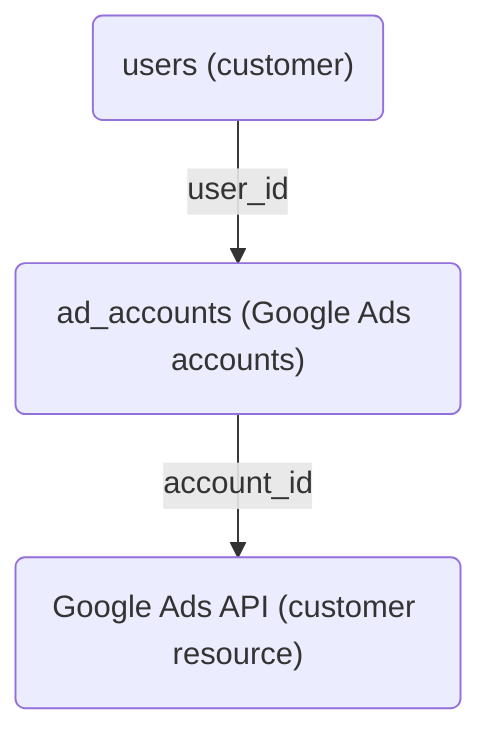
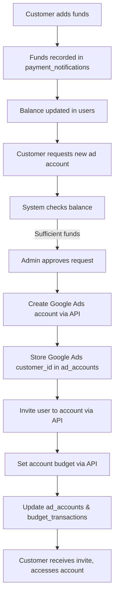
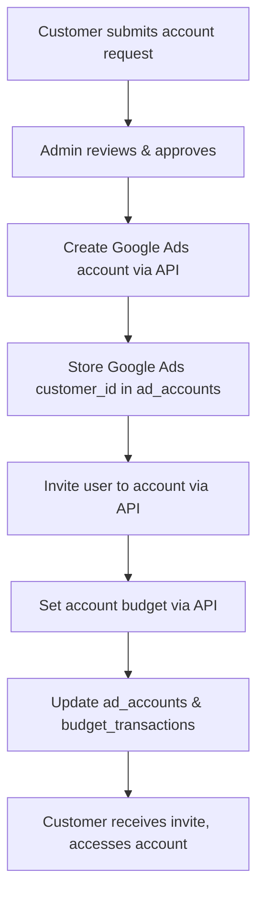
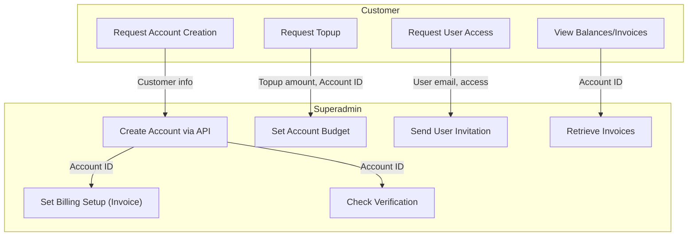
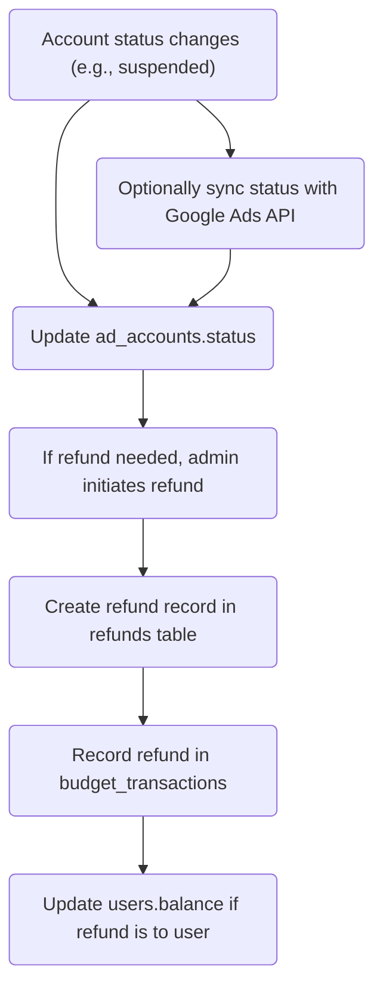

# Google Ads API Integration Guide

---

## Getting Started: Connecting to Google Ads API & Sandbox Setup

### 0. Install the Google Ads API PHP Client Library
- Make sure you have [Composer](https://getcomposer.org/) installed.
- In your project directory, run:
  ```bash
  composer require googleads/google-ads-php
  ```
- This will install the library and all dependencies in your `vendor/` directory.
- In your PHP code, include the autoloader:
  ```php
  require 'vendor/autoload.php';
  ```

### 1. What You Need
- **Google Cloud Project**: Create one at https://console.cloud.google.com/
- **Google Ads Manager (MCC) Account**: Needed to manage sub-accounts.
- **OAuth2 Credentials**: Create OAuth2 client ID/secret in Google Cloud Console.
- **Developer Token**: Request from Google Ads API Center (in your MCC account).
- **Refresh Token**: Needed for API authentication (see below for how to get it).
- **Google Ads API PHP Client Library**: [GitHub](https://github.com/googleads/google-ads-php)

### 2. How to Connect (PHP Example)
```php
require 'vendor/autoload.php';
use Google\Ads\GoogleAds\Lib\V14\GoogleAdsClientBuilder;

$client = (new GoogleAdsClientBuilder())
    ->fromFile('google_ads_php.ini') // Or use ->withXyz() methods
    ->build();
```

**Example `google_ads_php.ini`:**
```
developerToken = "INSERT_YOUR_DEVELOPER_TOKEN"
clientId = "INSERT_YOUR_CLIENT_ID"
clientSecret = "INSERT_YOUR_CLIENT_SECRET"
refreshToken = "INSERT_YOUR_REFRESH_TOKEN"
loginCustomerId = "INSERT_YOUR_MCC_ID" # Optional, for manager accounts
```

### 3. How to Get a Refresh Token (for Testing/Sandbox)
1. **Create OAuth2 credentials** in Google Cloud Console (type: Desktop app is easiest for testing).
2. **Use the Google Ads PHP client’s `GenerateRefreshToken.php` script** (found in `/examples/Authentication/`).
   - Run: `php examples/Authentication/GenerateRefreshToken.php`
   - Follow the link, log in with your test Google account (not production!), and paste the code back.
   - You’ll get a refresh token for that user.
3. **Use this refresh token in your test config.**

### 4. How to Set Up a Sandbox/Test Environment
- **Google Ads API does not have a true sandbox,** but you can use a separate test MCC and test sub-accounts.
- **Best practice:**
  - Create a new Google account for testing.
  - Create a new MCC (manager) account with this test user.
  - Request a developer token for this test MCC (mark as test/non-production if possible).
  - Use this test MCC and its sub-accounts for all development/testing.
  - Use a separate OAuth2 client and refresh token for test vs. production.
- **Never use your production MCC or real customer accounts for testing!**

### 5. Switching Between Test and Production
- Use different `google_ads_php.ini` files or environment variables for test and prod.
- Example:
  - `google_ads_php_test.ini` (test credentials, test refresh token, test MCC)
  - `google_ads_php_prod.ini` (prod credentials, prod refresh token, prod MCC)
- In your code, load the correct config based on environment.

### 6. Quick Checklist
- [x] Google Cloud Project created
- [x] OAuth2 credentials (client ID/secret)
- [x] Developer token (test and prod)
- [x] Refresh token for test user (see above)
- [x] Separate test and prod config files
- [x] Never use real customer data for testing

---

## Overview
This document describes how Google Ads API features are integrated into the system, separating responsibilities between the `customer` (advertiser) and `superadmin` (admin) sides. It also details the data flow and parameters passed for each major action, with a focus on credit line (invoice) payment workflows.

---

## System Relationship: Customers and Google Ads Accounts

### Key Concepts
- **Customer (User):** A person or business using your platform, stored in the `users` table.
- **Ad Account:** A Google Ads account (called a "customer" in Google Ads API), stored in the `ad_accounts` table, and linked to a user via `user_id`.
- **One-to-Many:** Each customer (user) can have multiple ad accounts. Each ad account is mapped to a Google Ads account (customer).

### How It Works in Your System
- Customers register and are managed in your `users` table.
- Customers can add funds to their balance (see `payment_notifications` table).
- Customers can request new Google Ads accounts (ad accounts) if they have sufficient balance.
- Each ad account is created in Google Ads via the API and mapped in your `ad_accounts` table.

### Visual: Relationship Diagram


---

## End-to-End Flow: Funding and Account Creation

### 1. Customer Adds Funds
- Customer deposits money (recorded in `payment_notifications` with `status = completed`).
- User's available balance is updated in the `users.balance` field.

### 2. Customer Requests a Google Ads Account
- Customer submits a request (stored in `account_requests`).
- System checks if the user has enough balance (`users.balance` >= required amount).
- If approved, superadmin triggers Google Ads API to create a new account.
- The new Google Ads customer id is stored in `ad_accounts.account_id` and linked to the user via `user_id`.
- Optionally, the system invites the user to access the account using their email (`gmail`).
- The initial budget for the ad account is set using the Google Ads API (AccountBudgetProposal).
- All transactions (funding, spends, refunds) are tracked in `budget_transactions`.

### 3. Ongoing Management
- Customers can view their ad accounts, balances, and spend history.
- Additional top-ups and budget changes are managed via your system and the Google Ads API.

---

## What Happens Where: System vs. Google Ads API

| Step                        | Our System (DB/Logic)                | Google Ads API Action                |
|-----------------------------|--------------------------------------|--------------------------------------|
| Customer registration       | Insert into `users`                  | None                                 |
| Add funds                   | Insert into `payment_notifications`, update `users.balance` | None (funds managed in your system)  |
| Request ad account          | Insert into `account_requests`       | None                                 |
| Approve ad account request  | Check balance, deduct amount, create in `ad_accounts` | Create Google Ads account (customer) |
| Invite user to ad account   | Update `ad_accounts`                 | Send invitation via API              |
| Set ad account budget       | Update `ad_accounts`, insert into `budget_transactions` | Set budget via API                   |
| Track spend/refunds         | Insert into `budget_transactions`    | None (spend data can be synced from API if needed) |

---

## Example SQL Table Mapping

- **users**: Stores customer info and balance
- **payment_notifications**: Tracks deposits/top-ups
- **account_requests**: Tracks requests for new ad accounts
- **ad_accounts**: Maps each ad account to a user and Google Ads customer id
- **budget_transactions**: Tracks all budget changes, spends, and refunds

---

## Example Flow Diagram: Funding to Account Creation



---

## Google Ads API: Customer vs. Your Platform Users

- In Google Ads API, a “customer” is a Google Ads account (not a person/user).
- Your platform’s “users” are managed in your own `users` table.
- When you create a Google Ads account via the API, you’re creating a “customer” resource in Google’s system.
- You do **not** create a “person” in Google Ads; you create a Google Ads account for a business/user and invite them to access it.
- Your platform manages the mapping between your users and their Google Ads accounts.

---

## Field Mapping: Platform → Google Ads API

| Platform Field (account_requests/ad_accounts) | Google Ads API Parameter (Customer)         | Notes                                  |
|-----------------------------------------------|---------------------------------------------|----------------------------------------|
| account_name                                 | descriptive_name                            | Name for the Google Ads account        |
| gmail                                        | customer_user_access.email_address           | Email to invite as user                |
| timezone                                     | customer.time_zone                          | Must match Google’s supported timezones|
| currency                                     | customer.currency_code                      | 3-letter code, e.g. USD                |
| account_budget                               | AccountBudgetProposal.amount_micros         | Set after account creation             |
| user_id                                      | (internal only)                             | Not sent to Google Ads                 |
| account_id                                   | (Google Ads customer id)                    | Store after creation                   |
| creation_fee                                 | (internal, not sent)                        | Platform fee, not sent to Google Ads   |

**Required for Google Ads API account creation:**
- `descriptive_name` (from your `account_name`)
- `currency_code` (from your `currency`)
- `time_zone` (from your `timezone`)

**To invite the user to access the account:**
- Use `customer_user_access` API with `email_address` (from your `gmail`)

---

## Recommended Database Additions for Google Ads API Alignment

- `ad_accounts.invited_at` (datetime)
- `ad_accounts.invite_status` (enum: pending, sent, accepted, failed)
- `ad_accounts.invite_email` (varchar)
- `ad_accounts.google_ads_sync_status` (enum: pending, success, failed)
- `ad_accounts.google_ads_sync_error` (text)

**Example SQL:**
```sql
ALTER TABLE ad_accounts
  ADD COLUMN invited_at DATETIME NULL,
  ADD COLUMN invite_status ENUM('pending','sent','accepted','failed') DEFAULT 'pending',
  ADD COLUMN invite_email VARCHAR(255) NULL,
  ADD COLUMN google_ads_sync_status ENUM('pending','success','failed') DEFAULT 'pending',
  ADD COLUMN google_ads_sync_error TEXT NULL;
```

---

## Corrected Account Creation & User Access Flow



---

## Feature Mapping: Customer vs. Superadmin

| Feature                | API Service/Resource                | Customer Side (customer/) | Superadmin Side (superadmin/) | Parameters/Data Passed                |
|------------------------|-------------------------------------|:------------------------:|:-----------------------------:|----------------------------------------|
| Account Creation       | CustomerService                     | Request new account      | Create account via API        | Customer name, email, business info    |
| Invite Access          | CustomerUserAccessInvitationService | Request/view invitations | Send/cancel invitations       | User email, access level               |
| Advertiser Verification| Customer/CustomerClient             | View status              | Check/trigger verification    | Account ID                             |
| Billing Setup          | BillingSetupService                 | View billing info        | Link payment profile (invoice)| Account ID, payment profile            |
| Topup (Budget)         | AccountBudgetService                | Request/view topup       | Set/adjust budget via API     | Account ID, budget amount              |
| Invoice                | InvoiceService                      | View/download invoices   | Retrieve invoices via API     | Account ID, invoice period             |

---

## Integration Flow



---

## Data/Parameters Passed from Customer to Superadmin/API

- **Account Creation:**
  - Customer name
  - Email
  - Business info (address, phone, etc.)
- **Invite Access:**
  - Email to invite
  - Access level (admin, standard, read-only)
- **Topup Request:**
  - Amount
  - Account ID
- **Invoice View:**
  - Account ID
  - Date range/period

---

## Example Integration Points

- **Customer Dashboard:**
  - Shows balances, budgets, invoices (data fetched from backend or via API through superadmin).
  - Allows requests for new accounts, topups, and user access.
- **Superadmin Panel:**
  - Handles all Google Ads API calls (account creation, billing setup, budget management, invoice retrieval, user invitations, verification checks).
  - Approves and processes customer requests.

---

## Security & Permissions

- Only superadmin holds Google Ads API credentials and performs sensitive API actions.
- Customer actions are requests; superadmin approves and executes via API.
- All sensitive data (API keys, payment profiles) are managed server-side by superadmin.

---

## How to Integrate Google Ads APIs in This System

### Current SQL Parameters vs. Google Ads API Parameters

| Feature                | SQL Parameter(s)                        | Google Ads API Parameter(s)         |
|------------------------|-----------------------------------------|-------------------------------------|
| Account Creation       | user_id, account_name, gmail, timezone, account_budget | customer_name, email, timezone, currency, account_budget |
| Invite Access          | email, access_level, account_id         | email_address, access_role, customer_id |
| Topup (Budget)         | account_id, amount                      | customer_id, amount_micros          |
| Invoice                | account_id, date range                  | customer_id, issue_year, issue_month |
| Billing Setup          | account_id, payment_profile             | customer_id, payments_account       |
| Advertiser Verification| account_id                              | customer_id                         |

### Integration Flow Example

1. **Customer Side:**
   - User submits a request (e.g., account creation, topup, invite access) via dashboard.
   - Data is sent to the superadmin backend (with mapped parameters).

2. **Superadmin Side:**
   - Receives request, validates/approves.
   - Calls the appropriate Google Ads API endpoint using the mapped parameters.
   - Updates local database with the result/status.

### Example: Topup Request (Account Budget)

- **Customer submits:**
  - `account_id`, `amount`
- **Superadmin calls Google Ads API:**
  ```php
  $accountBudgetProposal = new AccountBudgetProposal([
      'customer_id' => $customerId, // from account_id mapping
      'amount_micros' => $amount * 1000000, // Convert to micros
      // ... other params as needed
  ]);
  // Call mutateAccountBudgetProposal() with the proposal
  ```

### Example: Account Creation
- **Customer submits:**
  - `account_name`, `gmail`, `timezone`, `account_budget`
- **Superadmin calls Google Ads API:**
  ```php
  $customer = new Customer([
      'descriptive_name' => $accountName,
      'currency_code' => $currency,
      'time_zone' => $timezone,
      // ... other params
  ]);
  // Call CustomerService.MutateCustomer() to create
  ```

### Example: Invite Access
- **Customer submits:**
  - `email`, `access_level`, `account_id`
- **Superadmin calls Google Ads API:**
  ```php
  $invitation = new CustomerUserAccessInvitation([
      'email_address' => $email,
      'access_role' => $accessRole,
  ]);
  // Call CustomerUserAccessInvitationService.MutateCustomerUserAccessInvitation()
  ```

### Notes
- All API calls should be handled by the superadmin backend for security.
- Customer side only sends requests and receives status/results.
- Use the [Google Ads API PHP Client Library](https://github.com/googleads/google-ads-php) for implementation.
- Always map and validate parameters before sending to the API. 

---

# Google Ads API Integration: Detailed Implementation Guide

This section provides a comprehensive, step-by-step guide for integrating each major Google Ads API into your current PHP system. It includes what each API does, when and where to call it, how it fits into your workflow, parameter mapping, and example PHP code for the superadmin backend. This is suitable for sharing with clients or developers.

---

## 1. Account Creation API
**Docs:** https://developers.google.com/google-ads/api/docs/account-management/create-account?hl=en

**Purpose:**
- Create a new Google Ads account (child) under your manager (MCC) account.

**When/Where to Call:**
- After a customer submits a new account request via the dashboard (customer side).
- Superadmin backend receives the request and calls the API.

**Parameter Mapping:**
| Customer Input / SQL Param | Google Ads API Param |
|---------------------------|---------------------|
| account_name              | descriptive_name    |
| currency                  | currency_code       |
| timezone                  | time_zone           |

**Integration Flow:**
1. Customer submits account creation form.
2. PHP backend stores request in `account_requests` table.
3. Superadmin reviews and approves request.
4. Superadmin backend calls Google Ads API to create the account.
5. Result/status is saved and shown to customer.

**PHP Example (Superadmin):**
```php
// Use Google Ads API PHP Client Library
$customer = new Customer([
    'descriptive_name' => $accountName,
    'currency_code' => $currency,
    'time_zone' => $timezone,
]);
$customerServiceClient->createCustomerClient($managerCustomerId, $customer);
```

---

## 2. Invite Access API
**Docs:** https://developers.google.com/google-ads/api/docs/account-management/managing-invitations?hl=en

**Purpose:**
- Invite a user to access a Google Ads account (e.g., customer or their team).

**When/Where to Call:**
- When a customer requests to add a user to their account.
- Superadmin backend processes the request and calls the API.

**Parameter Mapping:**
| Customer Input / SQL Param | Google Ads API Param |
|---------------------------|---------------------|
| email                     | email_address       |
| access_level              | access_role         |
| account_id                | customer_id         |

**Integration Flow:**
1. Customer submits invite request (email, access level).
2. PHP backend stores request.
3. Superadmin reviews and approves.
4. Superadmin backend calls Google Ads API to send invitation.
5. Status/result is saved and shown to customer.

**PHP Example (Superadmin):**
```php
$invitation = new CustomerUserAccessInvitation([
    'email_address' => $email,
    'access_role' => $accessRole,
]);
$invitationServiceClient->createCustomerUserAccessInvitation($customerId, $invitation);
```

---

## 3. Advertiser Verification API
**Docs:** https://developers.google.com/google-ads/api/docs/account-management/advertiser-identity-verification?hl=en

**Purpose:**
- Check or manage the advertiser identity verification status for a Google Ads account.

**When/Where to Call:**
- When customer or admin wants to check verification status.
- Superadmin backend queries the API.

**Parameter Mapping:**
| Customer Input / SQL Param | Google Ads API Param |
|---------------------------|---------------------|
| account_id                | customer_id         |

**Integration Flow:**
1. Customer requests verification status.
2. PHP backend queries Google Ads API for status.
3. Status/result is shown to customer.

**PHP Example (Superadmin):**
```php
// Fetch customer resource
$customer = $customerServiceClient->getCustomer($customerId);
$status = $customer->getAdvertiserVerificationStatus();
```

---

## 4. Billing Setup API (Invoice Payment)
**Docs:** https://developers.google.com/google-ads/api/docs/billing/billing-setups?hl=en

**Purpose:**
- Link a Google Ads account to a payment profile (for credit line/invoice payment).

**When/Where to Call:**
- After account creation, before running ads.
- Superadmin backend links the account to the invoice payment profile.

**Parameter Mapping:**
| Customer Input / SQL Param | Google Ads API Param |
|---------------------------|---------------------|
| account_id                | customer_id         |
| payment_profile           | payments_account    |

**Integration Flow:**
1. Customer account is created.
2. Superadmin backend links account to invoice payment profile via API.
3. Status/result is saved and shown to customer.

**PHP Example (Superadmin):**
```php
$billingSetup = new BillingSetup([
    'payments_account' => $paymentsAccountId,
]);
$billingSetupServiceClient->mutateBillingSetup($customerId, $billingSetup);
```

---

## 5. Topup (Account Budgets) API
**Docs:** https://developers.google.com/google-ads/api/docs/billing/account-budgets?hl=en

**Purpose:**
- Set or increase the budget for an account (required for invoice/credit line accounts).

**When/Where to Call:**
- When a customer requests a topup or budget increase.
- Superadmin backend processes and calls the API.

**Parameter Mapping:**
| Customer Input / SQL Param | Google Ads API Param |
|---------------------------|---------------------|
| account_id                | customer_id         |
| amount                    | amount_micros       |

**Integration Flow:**
1. Customer submits topup request (account, amount).
2. PHP backend stores request and deducts balance.
3. Superadmin reviews and approves.
4. Superadmin backend calls Google Ads API to increase budget.
5. Status/result is saved and shown to customer.

**PHP Example (Superadmin):**
```php
$proposal = new AccountBudgetProposal([
    'customer_id' => $customerId,
    'amount_micros' => $amount * 1000000, // $1 = 1,000,000 micros
    // ... other params
]);
$accountBudgetServiceClient->mutateAccountBudgetProposal($customerId, $proposal);
```

---

## 6. Invoice API
**Docs:** https://developers.google.com/google-ads/api/docs/billing/invoice?hl=en

**Purpose:**
- Retrieve invoices for accounts on monthly invoicing (credit line).

**When/Where to Call:**
- When a customer wants to view/download their invoice.
- Superadmin backend fetches invoice from API.

**Parameter Mapping:**
| Customer Input / SQL Param | Google Ads API Param |
|---------------------------|---------------------|
| account_id                | customer_id         |
| date (year/month)         | issue_year, issue_month |

**Integration Flow:**
1. Customer requests invoice (account, date).
2. PHP backend sends request to superadmin.
3. Superadmin backend calls Google Ads API to fetch invoice.
4. Invoice is shown/downloaded by customer.

**PHP Example (Superadmin):**
```php
$invoices = $invoiceServiceClient->listInvoices($customerId, $billingSetupId, $issueYear, $issueMonth);
// Loop through $invoices to display or download
```

---

# General Integration Notes
- All Google Ads API calls are handled by the superadmin backend for security.
- Customer side only sends requests and receives status/results.
- Use the [Google Ads API PHP Client Library](https://github.com/googleads/google-ads-php) for implementation.
- Always map and validate parameters before sending to the API.
- Update your local database with API results for reporting and customer dashboard.

--- 

---

## Managing Spend, Account Status, and Refunds

### 1. Spend Tracking
- **Your System:**
  - Spend is tracked in the `budget_transactions` table with `transaction_type = 'spend'` and linked to an ad account via `account_id`.
  - The `ad_accounts.total_spent` field can be updated to reflect the sum of all spend transactions for that account.
- **Google Ads API:**
  - Actual spend data can be retrieved from the Google Ads API (e.g., via reporting queries).
  - You can periodically sync spend from Google Ads to your system for reconciliation.

| SQL Table/Field           | Google Ads API Equivalent         | Notes                                 |
|--------------------------|-----------------------------------|---------------------------------------|
| budget_transactions      | Metrics from Google Ads reports   | Use API to fetch actual spend         |
| ad_accounts.total_spent  | Metrics from Google Ads reports   | Can be updated from API data          |

### 2. Account Status (Active, Suspended, Disabled)
- **Your System:**
  - Account status is stored in `ad_accounts.status` (enum: 'active', 'paused', 'suspended', 'disabled').
  - Status changes are managed by your admin panel and reflected in your UI.
- **Google Ads API:**
  - Account status can be read from the API (e.g., `Customer.status` or via account-level policy/serving status).
  - You can update your local status field based on API data, or use your own logic for internal status.
  - Some status changes (like suspending an account) may require action via the API (e.g., pausing campaigns, requesting account suspension).

| SQL Table/Field      | Google Ads API Field/Action         | Notes                                 |
|---------------------|--------------------------------------|---------------------------------------|
| ad_accounts.status  | Customer.status, policy summaries    | Sync or map as needed                 |

### 3. Refunds
- **Your System:**
  - Refunds are tracked in the `refunds` table, linked to both `ad_accounts` and `users`.
  - Refund transactions are also recorded in `budget_transactions` with `transaction_type = 'refund'`.
  - Admins can process and approve refunds, updating the relevant tables.
- **Google Ads API:**
  - Google Ads does not provide a direct refund API for account balances. Refunds are handled in your system (e.g., returning unused balance to the user).
  - If an account is suspended or banned, you may process a refund internally and update your records.

| SQL Table/Field         | Google Ads API Equivalent         | Notes                                 |
|------------------------|-----------------------------------|---------------------------------------|
| refunds                | (No direct API)                   | Handled by your system                |
| budget_transactions    | (No direct API)                   | Record refund as a transaction        |

### 4. Example Status & Refund Flow



--- 

---

## Practical PHP Logic & Code Examples for Spend, Status, and Refunds

### 1. Spend Tracking
**How it works:**
- Record every spend in `budget_transactions` (`transaction_type = 'spend'`).
- Update `ad_accounts.total_spent`.
- Optionally, sync actual spend from Google Ads API.

**PHP Example:**
```php
// Record a spend transaction
$account_id = 36;
$amount_spent = 40.00;
$previous_balance = 2001.00;
$new_balance = $previous_balance - $amount_spent;

$stmt = $conn->prepare("INSERT INTO budget_transactions 
    (account_id, amount, previous_balance, new_balance, transaction_type, status, created_at)
    VALUES (?, ?, ?, ?, 'spend', 'completed', NOW())");
$stmt->execute([$account_id, $amount_spent, $previous_balance, $new_balance]);

// Update ad_accounts
$stmt = $conn->prepare("UPDATE ad_accounts 
    SET account_budget = ?, total_spent = total_spent + ? 
    WHERE id = ?");
$stmt->execute([$new_balance, $amount_spent, $account_id]);
```

**Syncing Spend from Google Ads API:**
- Use Google Ads API Reports to fetch spend, then update your tables as above.

---

### 2. Account Status (Active, Suspended, Disabled)
**How it works:**
- Status is stored in `ad_accounts.status`.
- Change status via admin panel or sync with Google Ads API.

**PHP Example:**
```php
// Change account status
$account_id = 36;
$new_status = 'suspended';
$stmt = $conn->prepare("UPDATE ad_accounts SET status = ? WHERE id = ?");
$stmt->execute([$new_status, $account_id]);
```

**Syncing with Google Ads API:**
- Fetch status from Google Ads API and update your local field.

---

### 3. Refunds
**How it works:**
- Create a record in `refunds`.
- Record the refund in `budget_transactions` (`transaction_type = 'refund'`).
- Update the user’s balance in `users`.

**PHP Example:**
```php
// Process a refund
$account_id = 36;
$user_id = 31;
$refund_amount = 15.00;
$account_balance_before = 10.00;
$reason = 'suspended';

$conn->beginTransaction();
// Insert into refunds
$stmt = $conn->prepare("INSERT INTO refunds 
    (account_id, user_id, refund_amount, account_balance_before, reason, status, created_at)
    VALUES (?, ?, ?, ?, ?, 'approved', NOW())");
$stmt->execute([$account_id, $user_id, $refund_amount, $account_balance_before, $reason]);
// Record in budget_transactions
$stmt = $conn->prepare("INSERT INTO budget_transactions 
    (account_id, amount, previous_balance, new_balance, transaction_type, status, created_at)
    VALUES (?, ?, ?, ?, 'refund', 'completed', NOW())");
$stmt->execute([$account_id, -$refund_amount, $account_balance_before, 0]);
// Update user's balance
$stmt = $conn->prepare("UPDATE users SET balance = balance + ? WHERE id = ?");
$stmt->execute([$refund_amount, $user_id]);
$conn->commit();
```

**Google Ads API and Refunds:**
- No direct refund endpoint; refunds are handled internally as above.

---

### 4. Full Example: Suspend and Refund Flow
```php
// Suspend account and process refund
$account_id = 36;
$user_id = 31;
$refund_amount = 15.00;
// 1. Suspend the account
$stmt = $conn->prepare("UPDATE ad_accounts SET status = 'suspended' WHERE id = ?");
$stmt->execute([$account_id]);
// 2. Process refund (see above)
```
