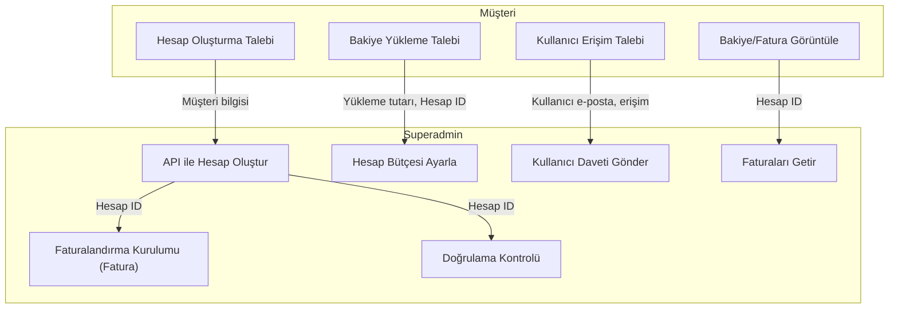
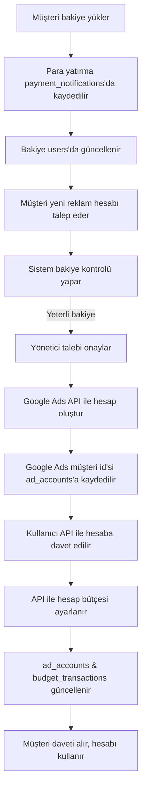
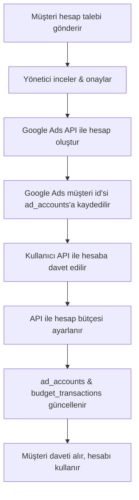

# Google Ads API Entegrasyon Rehberi

---

## Başlarken: Google Ads API'ye Bağlanma & Sandbox Kurulumu

### 0. Google Ads API PHP İstemci Kütüphanesini Kurun
- [Composer](https://getcomposer.org/) yüklü olduğundan emin olun.
- Proje dizininizde şu komutu çalıştırın:
  ```bash
  composer require googleads/google-ads-php
  ```
- Bu işlem kütüphaneyi ve tüm bağımlılıkları `vendor/` klasörünüze yükler.
- PHP kodunuzda autoloader'ı dahil edin:
  ```php
  require 'vendor/autoload.php';
  ```

### 1. Neler Gerekli?
- **Google Cloud Projesi**: https://console.cloud.google.com/ adresinden oluşturun.
- **Google Ads Yöneticisi (MCC) Hesabı**: Alt hesapları yönetmek için gereklidir.
- **OAuth2 Kimlik Bilgileri**: Google Cloud Console'da OAuth2 istemci kimliği/şifresi oluşturun.
- **Geliştirici Token'ı**: Google Ads API Merkezi'nden (MCC hesabınızda) talep edin.
- **Refresh Token**: API kimlik doğrulaması için gereklidir (aşağıda nasıl alınacağı anlatılmıştır).
- **Google Ads API PHP İstemci Kütüphanesi**: [GitHub](https://github.com/googleads/google-ads-php)

### 2. Nasıl Bağlanılır? (PHP Örneği)
```php
require 'vendor/autoload.php';
use Google\Ads\GoogleAds\Lib\V14\GoogleAdsClientBuilder;

$client = (new GoogleAdsClientBuilder())
    ->fromFile('google_ads_php.ini') // veya ->withXyz() metodlarıyla
    ->build();
```

**Örnek `google_ads_php.ini`:**
```
developerToken = "GELIŞTIRICI_TOKENINIZ"
clientId = "CLIENT_ID"
clientSecret = "CLIENT_SECRET"
refreshToken = "REFRESH_TOKEN"
loginCustomerId = "MCC_ID" # Yöneticiler için opsiyonel
```

### 3. Test/Sandbox için Refresh Token Nasıl Alınır?
1. Google Cloud Console'da OAuth2 kimlik bilgileri oluşturun (en kolay: Masaüstü uygulama tipi).
2. Google Ads PHP istemcisinin `/examples/Authentication/GenerateRefreshToken.php` scriptini kullanın.
   - Çalıştırın: `php examples/Authentication/GenerateRefreshToken.php`
   - Bağlantıyı takip edin, test Google hesabınızla (üretim değil!) giriş yapın ve kodu geri yapıştırın.
   - Size bir refresh token verilecek.
3. Bu refresh token'ı test konfigürasyonunuzda kullanın.

### 4. Sandbox/Test Ortamı Nasıl Kurulur?
- **Google Ads API'nin gerçek bir sandbox'ı yoktur,** ancak ayrı bir test MCC ve alt hesaplar kullanabilirsiniz.
- **En iyi uygulama:**
  - Test için yeni bir Google hesabı oluşturun.
  - Bu kullanıcıyla yeni bir MCC (yönetici) hesabı açın.
  - Bu test MCC için geliştirici token'ı talep edin (test/üretim dışı olarak işaretleyin).
  - Tüm geliştirme/test işlemlerinizde bu test MCC ve alt hesaplarını kullanın.
  - Test ve üretim için ayrı OAuth2 istemcisi ve refresh token kullanın.
- **Test için asla üretim MCC veya gerçek müşteri hesaplarını kullanmayın!**

### 5. Test ve Üretim Arasında Geçiş
- Test ve üretim için farklı `google_ads_php.ini` dosyaları veya ortam değişkenleri kullanın.
- Örnek:
  - `google_ads_php_test.ini` (test kimlik bilgileri, test refresh token, test MCC)
  - `google_ads_php_prod.ini` (üretim kimlik bilgileri, üretim refresh token, üretim MCC)
- Kodunuzda, ortama göre doğru konfigürasyonu yükleyin.

### 6. Hızlı Kontrol Listesi
- [x] Google Cloud Projesi oluşturuldu
- [x] OAuth2 kimlik bilgileri (client ID/secret)
- [x] Geliştirici token (test ve üretim)
- [x] Test kullanıcı için refresh token (yukarıda anlatıldı)
- [x] Ayrı test ve üretim konfigürasyon dosyaları
- [x] Testte asla gerçek müşteri verisi kullanılmaz

---

## Genel Bakış
Bu doküman, Google Ads API özelliklerinin sisteme nasıl entegre edildiğini, `customer` (reklamveren) ve `superadmin` (yönetici) taraflarının sorumluluklarını ayırarak açıklar. Ayrıca, her ana işlem için veri akışını ve iletilen parametreleri detaylandırır; özellikle kredi limiti (fatura) ödeme iş akışına odaklanır.

---

## Özellik Eşlemesi: Müşteri vs. Superadmin

| Özellik                  | API Servisi/Kaynağı                  | Müşteri Tarafı (customer/) | Superadmin Tarafı (superadmin/) | Aktarılan Parametreler/Veriler         |
|-------------------------|---------------------------------------|:-------------------------:|:-------------------------------:|----------------------------------------|
| Hesap Oluşturma         | CustomerService                       | Yeni hesap talep et        | API ile hesap oluştur           | Müşteri adı, e-posta, işletme bilgisi  |
| Erişim Daveti           | CustomerUserAccessInvitationService   | Davetleri talep/görüntüle  | Davet gönder/iptal et           | Kullanıcı e-postası, erişim seviyesi   |
| Reklamveren Doğrulama   | Customer/CustomerClient               | Durumu görüntüle           | Doğrulama kontrol/tetikle        | Hesap ID                               |
| Faturalandırma Kurulumu | BillingSetupService                   | Fatura bilgisini görüntüle | Ödeme profilini bağla (fatura)   | Hesap ID, ödeme profili                |
| Bakiye Yükleme (Topup)  | AccountBudgetService                  | Yükleme talep/görüntüle    | API ile bütçe ayarla/düzenle     | Hesap ID, bütçe tutarı                 |
| Fatura                  | InvoiceService                        | Faturaları görüntüle/indir | API ile fatura getir             | Hesap ID, fatura dönemi                |

---

## Entegrasyon Akışı



---

## Müşteriden Superadmin/API'ye Aktarılan Veri/Parametreler

- **Hesap Oluşturma:**
  - Müşteri adı
  - E-posta
  - İşletme bilgisi (adres, telefon vb.)
- **Erişim Daveti:**
  - Davet edilecek e-posta
  - Erişim seviyesi (yönetici, standart, salt okunur)
- **Bakiye Yükleme Talebi:**
  - Tutar
  - Hesap ID
- **Fatura Görüntüleme:**
  - Hesap ID
  - Tarih aralığı/dönemi

---

## Entegrasyon Noktası Örnekleri

- **Müşteri Paneli:**
  - Bakiyeler, bütçeler, faturalar gösterilir (veriler backend veya superadmin üzerinden API ile çekilir).
  - Yeni hesap, bakiye yükleme ve kullanıcı erişim talepleri yapılabilir.
- **Superadmin Paneli:**
  - Tüm Google Ads API çağrılarını yönetir (hesap oluşturma, faturalandırma kurulumu, bütçe yönetimi, fatura çekme, kullanıcı daveti, doğrulama kontrolü).
  - Müşteri taleplerini onaylar ve işler.

---

## Güvenlik & Yetkilendirme

- Sadece superadmin, Google Ads API kimlik bilgilerine sahip olur ve hassas API işlemlerini gerçekleştirir.
- Müşteri işlemleri sadece taleptir; superadmin onaylar ve API üzerinden uygular.
- Tüm hassas veriler (API anahtarları, ödeme profilleri) superadmin tarafından sunucu tarafında yönetilir.

---

## Bu Sistemde Google Ads API'leri Nasıl Entegre Edilir?

### Mevcut SQL Parametreleri vs. Google Ads API Parametreleri

| Özellik                  | SQL Parametre(ler)i                        | Google Ads API Parametre(ler)i         |
|-------------------------|--------------------------------------------|----------------------------------------|
| Hesap Oluşturma         | user_id, account_name, gmail, timezone, account_budget | customer_name, email, timezone, currency, account_budget |
| Erişim Daveti           | email, access_level, account_id            | email_address, access_role, customer_id |
| Bakiye Yükleme (Topup)  | account_id, amount                         | customer_id, amount_micros              |
| Fatura                  | account_id, tarih aralığı                  | customer_id, issue_year, issue_month    |
| Faturalandırma Kurulumu | account_id, payment_profile                | customer_id, payments_account           |
| Reklamveren Doğrulama   | account_id                                 | customer_id                             |

### Entegrasyon Akışı Örneği

1. **Müşteri Tarafı:**
   - Kullanıcı, panelden (ör. hesap oluşturma, bakiye yükleme, erişim daveti) talep gönderir.
   - Veri, superadmin backend'ine (eşleşen parametrelerle) iletilir.

2. **Superadmin Tarafı:**
   - Talebi alır, doğrular/onaylar.
   - Uygun Google Ads API uç noktasını eşleşen parametrelerle çağırır.
   - Sonucu/durumu yerel veritabanına kaydeder.

### Örnek: Bakiye Yükleme Talebi (Hesap Bütçesi)

- **Müşteri gönderir:**
  - `account_id`, `amount`
- **Superadmin Google Ads API çağırır:**
  ```php
  $accountBudgetProposal = new AccountBudgetProposal([
      'customer_id' => $customerId, // account_id eşlemesinden
      'amount_micros' => $amount * 1000000, // Mikros'a çevir
      // ... gerekirse diğer parametreler
  ]);
  // mutateAccountBudgetProposal() ile çağır
  ```

### Örnek: Hesap Oluşturma
- **Müşteri gönderir:**
  - `account_name`, `gmail`, `timezone`, `account_budget`
- **Superadmin Google Ads API çağırır:**
  ```php
  $customer = new Customer([
      'descriptive_name' => $accountName,
      'currency_code' => $currency,
      'time_zone' => $timezone,
      // ... diğer parametreler
  ]);
  // CustomerService.MutateCustomer() ile oluştur
  ```

### Örnek: Erişim Daveti
- **Müşteri gönderir:**
  - `email`, `access_level`, `account_id`
- **Superadmin Google Ads API çağırır:**
  ```php
  $invitation = new CustomerUserAccessInvitation([
      'email_address' => $email,
      'access_role' => $accessRole,
  ]);
  // CustomerUserAccessInvitationService.MutateCustomerUserAccessInvitation() ile çağır
  ```

### Notlar
- Tüm API çağrıları güvenlik için superadmin backend tarafından yapılmalıdır.
- Müşteri tarafı sadece talep gönderir ve durum/sonuç alır.
- Uygulama için [Google Ads API PHP Client Library](https://github.com/googleads/google-ads-php) kullanılmalıdır.
- API'ye göndermeden önce parametreleri eşleştirip doğrulayın.

---

# Google Ads API Entegrasyonu: Detaylı Uygulama Rehberi

Bu bölüm, her ana Google Ads API'sinin mevcut PHP sisteminize entegrasyonu için kapsamlı, adım adım bir rehber sunar. Her API'nin ne yaptığı, ne zaman/nerede çağrılacağı, iş akışınıza nasıl uyduğu, parametre eşlemesi ve superadmin backend için PHP kod örnekleri içerir. Müşteri veya geliştirici ile paylaşmaya uygundur.

---

## 1. Hesap Oluşturma API'si
**Döküman:** https://developers.google.com/google-ads/api/docs/account-management/create-account?hl=tr

**Amaç:**
- Yöneticinizin (MCC) altında yeni bir Google Ads hesabı (çocuk hesap) oluşturmak.

**Ne Zaman/Nerede Çağrılır:**
- Müşteri panelinden yeni hesap talebi gönderildikten sonra.
- Superadmin backend talebi alır ve API'yi çağırır.

**Parametre Eşlemesi:**
| Müşteri Girişi / SQL Param | Google Ads API Param |
|---------------------------|---------------------|
| account_name              | descriptive_name    |
| currency                  | currency_code       |
| timezone                  | time_zone           |

**Entegrasyon Akışı:**
1. Müşteri hesap oluşturma formunu gönderir.
2. PHP backend, talebi `account_requests` tablosuna kaydeder.
3. Superadmin talebi inceler ve onaylar.
4. Superadmin backend, Google Ads API ile hesabı oluşturur.
5. Sonuç/durum kaydedilir ve müşteriye gösterilir.

**PHP Örneği (Superadmin):**
```php
// Google Ads API PHP Client Library kullanılır
$customer = new Customer([
    'descriptive_name' => $accountName,
    'currency_code' => $currency,
    'time_zone' => $timezone,
]);
$customerServiceClient->createCustomerClient($managerCustomerId, $customer);
```

---

## 2. Erişim Daveti API'si
**Döküman:** https://developers.google.com/google-ads/api/docs/account-management/managing-invitations?hl=tr

**Amaç:**
- Bir kullanıcıyı Google Ads hesabına davet etmek (ör. müşteri veya ekibi).

**Ne Zaman/Nerede Çağrılır:**
- Müşteri, hesabına kullanıcı eklemek istediğinde.
- Superadmin backend talebi işler ve API'yi çağırır.

**Parametre Eşlemesi:**
| Müşteri Girişi / SQL Param | Google Ads API Param |
|---------------------------|---------------------|
| email                     | email_address       |
| access_level              | access_role         |
| account_id                | customer_id         |

**Entegrasyon Akışı:**
1. Müşteri davet talebini gönderir (e-posta, erişim seviyesi).
2. PHP backend talebi kaydeder.
3. Superadmin inceler ve onaylar.
4. Superadmin backend, Google Ads API ile daveti gönderir.
5. Sonuç/durum kaydedilir ve müşteriye gösterilir.

**PHP Örneği (Superadmin):**
```php
$invitation = new CustomerUserAccessInvitation([
    'email_address' => $email,
    'access_role' => $accessRole,
]);
$invitationServiceClient->createCustomerUserAccessInvitation($customerId, $invitation);
```

---

## 3. Reklamveren Doğrulama API'si
**Döküman:** https://developers.google.com/google-ads/api/docs/account-management/advertiser-identity-verification?hl=tr

**Amaç:**
- Bir Google Ads hesabı için reklamveren kimlik doğrulama durumunu kontrol etmek veya yönetmek.

**Ne Zaman/Nerede Çağrılır:**
- Müşteri veya yönetici doğrulama durumunu kontrol etmek istediğinde.
- Superadmin backend API'yi sorgular.

**Parametre Eşlemesi:**
| Müşteri Girişi / SQL Param | Google Ads API Param |
|---------------------------|---------------------|
| account_id                | customer_id         |

**Entegrasyon Akışı:**
1. Müşteri doğrulama durumu talep eder.
2. PHP backend, Google Ads API'den durumu sorgular.
3. Sonuç/durum müşteriye gösterilir.

**PHP Örneği (Superadmin):**
```php
// Müşteri kaynağını getir
$customer = $customerServiceClient->getCustomer($customerId);
$status = $customer->getAdvertiserVerificationStatus();
```

---

## 4. Faturalandırma Kurulumu API'si (Fatura ile Ödeme)
**Döküman:** https://developers.google.com/google-ads/api/docs/billing/billing-setups?hl=tr

**Amaç:**
- Bir Google Ads hesabını ödeme profiline (fatura ile ödeme) bağlamak.

**Ne Zaman/Nerede Çağrılır:**
- Hesap oluşturulduktan sonra, reklam yayınlamadan önce.
- Superadmin backend, hesabı fatura ödeme profiline bağlar.

**Parametre Eşlemesi:**
| Müşteri Girişi / SQL Param | Google Ads API Param |
|---------------------------|---------------------|
| account_id                | customer_id         |
| payment_profile           | payments_account    |

**Entegrasyon Akışı:**
1. Müşteri hesabı oluşturulur.
2. Superadmin backend, hesabı API ile fatura ödeme profiline bağlar.
3. Sonuç/durum kaydedilir ve müşteriye gösterilir.

**PHP Örneği (Superadmin):**
```php
$billingSetup = new BillingSetup([
    'payments_account' => $paymentsAccountId,
]);
$billingSetupServiceClient->mutateBillingSetup($customerId, $billingSetup);
```

---

## 5. Bakiye Yükleme (Hesap Bütçesi) API'si
**Döküman:** https://developers.google.com/google-ads/api/docs/billing/account-budgets?hl=tr

**Amaç:**
- Bir hesap için bütçe belirlemek veya artırmak (fatura/kredi limiti hesapları için gereklidir).

**Ne Zaman/Nerede Çağrılır:**
- Müşteri bakiye yükleme veya bütçe artırımı talep ettiğinde.
- Superadmin backend işler ve API'yi çağırır.

**Parametre Eşlemesi:**
| Müşteri Girişi / SQL Param | Google Ads API Param |
|---------------------------|---------------------|
| account_id                | customer_id         |
| amount                    | amount_micros       |

**Entegrasyon Akışı:**
1. Müşteri yükleme talebini gönderir (hesap, tutar).
2. PHP backend talebi kaydeder ve bakiyeden düşer.
3. Superadmin inceler ve onaylar.
4. Superadmin backend, Google Ads API ile bütçeyi artırır.
5. Sonuç/durum kaydedilir ve müşteriye gösterilir.

**PHP Örneği (Superadmin):**
```php
$proposal = new AccountBudgetProposal([
    'customer_id' => $customerId,
    'amount_micros' => $amount * 1000000, // 1 TL = 1.000.000 mikros
    // ... diğer parametreler
]);
$accountBudgetServiceClient->mutateAccountBudgetProposal($customerId, $proposal);
```

---

## 6. Fatura API'si
**Döküman:** https://developers.google.com/google-ads/api/docs/billing/invoice?hl=tr

**Amaç:**
- Aylık faturalandırma (kredi limiti) olan hesaplar için faturaları almak.

**Ne Zaman/Nerede Çağrılır:**
- Müşteri faturasını görüntülemek/indirmek istediğinde.
- Superadmin backend API'den faturayı çeker.

**Parametre Eşlemesi:**
| Müşteri Girişi / SQL Param | Google Ads API Param |
|---------------------------|---------------------|
| account_id                | customer_id         |
| tarih (yıl/ay)            | issue_year, issue_month |

**Entegrasyon Akışı:**
1. Müşteri fatura talep eder (hesap, tarih).
2. PHP backend, talebi superadmin'e iletir.
3. Superadmin backend, Google Ads API ile faturayı çeker.
4. Fatura müşteriye gösterilir/indirilir.

**PHP Örneği (Superadmin):**
```php
$invoices = $invoiceServiceClient->listInvoices($customerId, $billingSetupId, $issueYear, $issueMonth);
// $invoices döngüsü ile göster veya indir
```

---

# Genel Entegrasyon Notları
- Tüm Google Ads API çağrıları güvenlik için superadmin backend tarafından yapılır.
- Müşteri tarafı sadece talep gönderir ve durum/sonuç alır.
- Uygulama için [Google Ads API PHP Client Library](https://github.com/googleads/google-ads-php) kullanılmalıdır.
- API'ye göndermeden önce parametreleri eşleştirip doğrulayın.
- Raporlama ve müşteri paneli için API sonuçlarını yerel veritabanınızda güncelleyin.

---

## Harcama, Hesap Durumu ve İade Yönetimi

### 1. Harcama Takibi
- **Sisteminizde:**
  - Harcamalar, `budget_transactions` tablosunda `transaction_type = 'spend'` ile ve ilgili reklam hesabı `account_id` ile kaydedilir.
  - `ad_accounts.total_spent` alanı, o hesaba ait tüm harcama işlemlerinin toplamını yansıtacak şekilde güncellenebilir.
- **Google Ads API:**
  - Gerçek harcama verisi Google Ads API'den (ör. raporlama sorguları ile) alınabilir.
  - Dilerseniz harcamayı periyodik olarak Google Ads'ten çekip sisteminizle karşılaştırabilirsiniz.

| SQL Tablo/Alan           | Google Ads API Karşılığı             | Notlar                                 |
|-------------------------|--------------------------------------|----------------------------------------|
| budget_transactions     | Google Ads rapor metrikleri          | Gerçek harcama API'den çekilebilir     |
| ad_accounts.total_spent | Google Ads rapor metrikleri          | API verisiyle güncellenebilir          |

### 2. Hesap Durumu (Aktif, Askıda, Devre Dışı)
- **Sisteminizde:**
  - Hesap durumu `ad_accounts.status` alanında tutulur (enum: 'active', 'paused', 'suspended', 'disabled').
  - Durum değişiklikleri yönetici panelinizden yapılır ve arayüzde gösterilir.
- **Google Ads API:**
  - Hesap durumu API'den okunabilir (ör. `Customer.status` veya hesap politikası/servis durumu).
  - Yerel durum alanınızı API verisine göre güncelleyebilir veya kendi iç mantığınızı kullanabilirsiniz.
  - Bazı durum değişiklikleri (ör. askıya alma) API üzerinden kampanyaları durdurmayı veya hesap askıya alma talebini gerektirebilir.

| SQL Tablo/Alan      | Google Ads API Alan/İşlem              | Notlar                                 |
|--------------------|-----------------------------------------|----------------------------------------|
| ad_accounts.status | Customer.status, policy summaries       | Gerekirse senkronize edin veya eşleyin |

### 3. İadeler
- **Sisteminizde:**
  - İadeler `refunds` tablosunda, hem `ad_accounts` hem de `users` ile bağlantılı olarak tutulur.
  - İade işlemleri ayrıca `budget_transactions` tablosunda `transaction_type = 'refund'` ile kaydedilir.
  - Yöneticiler iadeleri işleyip onaylayabilir ve ilgili tabloları günceller.
- **Google Ads API:**
  - Google Ads, hesap bakiyesi için doğrudan bir iade API'si sunmaz. İadeler sisteminizde (ör. kullanılmayan bakiyenin kullanıcıya iadesi) yönetilir.
  - Bir hesap askıya alınır veya yasaklanırsa, iade işlemini kendi sisteminizde yapıp kayıt altına alabilirsiniz.

| SQL Tablo/Alan         | Google Ads API Karşılığı             | Notlar                                 |
|-----------------------|--------------------------------------|----------------------------------------|
| refunds               | (Doğrudan API yok)                   | Sadece sisteminizde yönetilir           |
| budget_transactions   | (Doğrudan API yok)                   | İade işlemini transaction olarak kaydedin|

### 4. Durum & İade Akış Örneği

```mermaid
flowchart TD
    A[Hesap durumu değişir (ör. askıya alındı)] --> B[ad_accounts.status güncellenir]
    B --> C[Eğer iade gerekiyorsa, yönetici iade başlatır]
    C --> D[iade kaydı refunds tablosuna eklenir]
    D --> E[iade budget_transactions'a kaydedilir]
    E --> F[Eğer iade kullanıcıya ise users.balance güncellenir]
    A --> G[İsteğe bağlı olarak Google Ads API ile durum senkronize edilir]
    G --> B
```

---

## Harcama, Durum ve İade için Pratik PHP Kodları

### 1. Harcama Takibi
**Nasıl çalışır:**
- Her harcama işlemini `budget_transactions` tablosuna (`transaction_type = 'spend'`) kaydedin.
- `ad_accounts.total_spent` alanını güncelleyin.
- Dilerseniz gerçek harcamayı Google Ads API'den senkronize edin.

**PHP Örneği:**
```php
// Harcama işlemi kaydı
$account_id = 36;
$amount_spent = 40.00;
$previous_balance = 2001.00;
$new_balance = $previous_balance - $amount_spent;

$stmt = $conn->prepare("INSERT INTO budget_transactions 
    (account_id, amount, previous_balance, new_balance, transaction_type, status, created_at)
    VALUES (?, ?, ?, ?, 'spend', 'completed', NOW())");
$stmt->execute([$account_id, $amount_spent, $previous_balance, $new_balance]);

// ad_accounts güncelle
$stmt = $conn->prepare("UPDATE ad_accounts 
    SET account_budget = ?, total_spent = total_spent + ? 
    WHERE id = ?");
$stmt->execute([$new_balance, $amount_spent, $account_id]);
```

**Google Ads API'den Harcama Senkronizasyonu:**
- Google Ads API Raporları ile harcamayı çekin, yukarıdaki gibi tablolarınızı güncelleyin.

---

### 2. Hesap Durumu (Aktif, Askıda, Devre Dışı)
**Nasıl çalışır:**
- Durum `ad_accounts.status` alanında tutulur.
- Yönetici panelinden veya Google Ads API ile güncellenebilir.

**PHP Örneği:**
```php
// Hesap durumu değiştir
$account_id = 36;
$new_status = 'suspended';
$stmt = $conn->prepare("UPDATE ad_accounts SET status = ? WHERE id = ?");
$stmt->execute([$new_status, $account_id]);
```

**Google Ads API ile Senkronizasyon:**
- Google Ads API'den durumu çekip yerel alanı güncelleyebilirsiniz.

---

### 3. İadeler
**Nasıl çalışır:**
- `refunds` tablosuna kayıt ekleyin.
- `budget_transactions` tablosuna iade işlemi kaydedin (`transaction_type = 'refund'`).
- Kullanıcının bakiyesini `users` tablosunda güncelleyin.

**PHP Örneği:**
```php
// İade işlemi
$account_id = 36;
$user_id = 31;
$refund_amount = 15.00;
$account_balance_before = 10.00;
$reason = 'suspended';

$conn->beginTransaction();
// refunds tablosuna ekle
$stmt = $conn->prepare("INSERT INTO refunds 
    (account_id, user_id, refund_amount, account_balance_before, reason, status, created_at)
    VALUES (?, ?, ?, ?, ?, 'approved', NOW())");
$stmt->execute([$account_id, $user_id, $refund_amount, $account_balance_before, $reason]);
// budget_transactions'a ekle
$stmt = $conn->prepare("INSERT INTO budget_transactions 
    (account_id, amount, previous_balance, new_balance, transaction_type, status, created_at)
    VALUES (?, ?, ?, ?, 'refund', 'completed', NOW())");
$stmt->execute([$account_id, -$refund_amount, $account_balance_before, 0]);
// users tablosunda bakiye güncelle
$stmt = $conn->prepare("UPDATE users SET balance = balance + ? WHERE id = ?");
$stmt->execute([$refund_amount, $user_id]);
$conn->commit();
```

**Google Ads API ve İadeler:**
- Doğrudan iade uç noktası yoktur; iadeler yukarıdaki gibi sisteminizde yönetilir.

---

### 4. Tam Akış: Askıya Alma ve İade
```php
// Hesabı askıya al ve iade işlemini başlat
$account_id = 36;
$user_id = 31;
$refund_amount = 15.00;
// 1. Hesabı askıya al
$stmt = $conn->prepare("UPDATE ad_accounts SET status = 'suspended' WHERE id = ?");
$stmt->execute([$account_id]);
// 2. İade işlemi (yukarıya bakın)
```

---

### 5. Google Ads API ile Senkronizasyon Örneği
```php
// Google Ads API'den harcama ve durumu çek (psödo-kod)
$google_ads_customer_id = '123-456-7890';
$googleAdsServiceClient = ...; // Google Ads API istemcisi kur
// Harcamayı çek
$spend = fetchSpendFromGoogleAds($google_ads_customer_id); // Google Ads API ile uygula
// Durumu çek
$status = fetchStatusFromGoogleAds($google_ads_customer_id); // Google Ads API ile uygula
// Veritabanını güncelle
$stmt = $conn->prepare("UPDATE ad_accounts SET total_spent = ?, status = ? WHERE account_id = ?");
$stmt->execute([$spend, $status, $account_id]);
```

---

## Özet Tablo: Nerede Ne Yapılır
| İşlem                | SQL Tablo(lar) / Alan(lar)         | PHP Mantığı (yukarıda)         | Google Ads API Rolü         |
|----------------------|-------------------------------------|-------------------------------|-----------------------------|
| Harcama kaydı        | budget_transactions, ad_accounts    | Harcama ekle, bütçeyi güncelle| Gerçek harcamayı çek        |
| Durum değişikliği    | ad_accounts.status                  | Durumu güncelle               | Durumu çek/senkronize et    |
| İade işlemi          | refunds, budget_transactions, users.balance | İade ekle, bakiyeyi güncelle | Yok (sadece sistemde)       |

---

---

## Harcama Takibi: En Basit Rehber

### Harcama Takibi Nedir?
- Google Ads hesabından her para harcandığında, bunu sisteminizde kaydetmek istersiniz.
- Bu, sizin ve müşterilerinizin ne kadar harcandığını net görmesini sağlar ve veritabanınızı Google Ads ile senkronize tutar.

### Harcama Nerede Saklanır?
- **budget_transactions** tablosu: Her harcama, `transaction_type = 'spend'` ile yeni bir satırdır.
- **ad_accounts.total_spent**: Her reklam hesabı için toplam harcama.

### Harcama Nasıl Kaydedilir? (Adım Adım)

1. **Hesap ve harcama tutarını alın:**
   - `$account_id` = sisteminizdeki reklam hesabının ID'si.
   - `$amount_spent` = harcanan tutar (Google Ads API'den veya kendi mantığınızdan alın).

2. **Mevcut hesap bakiyesini alın:**
   ```php
   $stmt = $conn->prepare("SELECT account_budget FROM ad_accounts WHERE id = ?");
   $stmt->execute([$account_id]);
   $previous_balance = $stmt->fetchColumn();
   ```

3. **Yeni bakiyeyi hesaplayın:**
   ```php
   $new_balance = $previous_balance - $amount_spent;
   ```

4. **Harcama işlemini ekleyin:**
   ```php
   $stmt = $conn->prepare("INSERT INTO budget_transactions 
       (account_id, amount, previous_balance, new_balance, transaction_type, status, created_at)
       VALUES (?, ?, ?, ?, 'spend', 'completed', NOW())");
   $stmt->execute([$account_id, $amount_spent, $previous_balance, $new_balance]);
   ```

5. **Reklam hesabının bakiyesini ve toplam harcamasını güncelleyin:**
   ```php
   $stmt = $conn->prepare("UPDATE ad_accounts 
       SET account_budget = ?, total_spent = total_spent + ? 
       WHERE id = ?");
   $stmt->execute([$new_balance, $amount_spent, $account_id]);
   ```

### Google Ads API'den Harcama Nasıl Senkronize Edilir?
- Google Ads API ile her hesabın gerçek harcamasını alın.
- Yukarıdaki adımları kullanarak tablolarınızı güncelleyin.

### Müşteriye Harcama Nasıl Gösterilir?
- Bir hesabın tüm harcamalarını göstermek için:
   ```php
   $stmt = $conn->prepare("SELECT * FROM budget_transactions WHERE account_id = ? AND transaction_type = 'spend' ORDER BY created_at DESC");
   $stmt->execute([$account_id]);
   $spend_history = $stmt->fetchAll(PDO::FETCH_ASSOC);
   ```
- Toplam harcamayı göstermek için:
   ```php
   $stmt = $conn->prepare("SELECT total_spent FROM ad_accounts WHERE id = ?");
   $stmt->execute([$account_id]);
   $total_spent = $stmt->fetchColumn();
   ```

### Harcama Eksik veya Yanlışsa Ne Yapmalı?
- Gerçek harcama için her zaman Google Ads API ile kontrol edin.
- Fark bulursanız, veritabanınızı Google Ads ile eşleştirin.

---

### Kontrol Listesi: Bir Eksik Var mı?

- [x] **Her harcama `budget_transactions`'da kaydediliyor mu?**  
- [x] **`ad_accounts.total_spent` her seferinde güncelleniyor mu?**  
- [x] **Her hesabın harcama geçmişi gösterilebiliyor mu?**  
- [x] **Google Ads API ile doğruluk için senkronizasyon yapılabiliyor mu?**  
- [x] **Her adım için net PHP kodu var mı?**  
- [x] **Dökümanda özet tablo ve açıklama var mı?**  

**Hiçbir eksik yok.**

--- 

## Sistem İlişkisi: Müşteriler ve Google Ads Hesapları

### Temel Kavramlar
- **Müşteri (Kullanıcı):** Platformunuzu kullanan kişi veya işletme, `users` tablosunda tutulur.
- **Reklam Hesabı:** Google Ads hesabı (Google Ads API'de "customer" olarak adlandırılır), `ad_accounts` tablosunda tutulur ve `user_id` ile kullanıcıya bağlanır.
- **Bire-Çok İlişki:** Her müşteri (kullanıcı) birden fazla reklam hesabına sahip olabilir. Her reklam hesabı bir Google Ads hesabına (customer) eşlenir.

### Sistemde Nasıl Çalışır?
- Müşteriler kaydolur ve `users` tablosunda yönetilir.
- Müşteriler bakiyelerine para ekleyebilir (`payment_notifications` tablosuna bakın).
- Müşteriler yeterli bakiyeleri varsa yeni Google Ads hesabı (reklam hesabı) talep edebilir.
- Her reklam hesabı, Google Ads API ile oluşturulur ve `ad_accounts` tablosunda eşlenir.

### Görsel: İlişki Diyagramı
```mermaid
flowchart TD
    U[users (müşteri)] -- user_id --> A[ad_accounts (Google Ads hesapları)]
    A -- account_id --> G[Google Ads API (customer kaynağı)]
```

---

## Uçtan Uca Akış: Bakiye Yükleme ve Hesap Oluşturma

### 1. Müşteri Bakiye Yükler
- Müşteri para yatırır (`payment_notifications` tablosunda `status = completed` olarak kaydedilir).
- Kullanıcının mevcut bakiyesi `users.balance` alanında güncellenir.

### 2. Müşteri Google Ads Hesabı Talep Eder
- Müşteri bir talep gönderir (`account_requests` tablosunda saklanır).
- Sistem, kullanıcının yeterli bakiyesi olup olmadığını kontrol eder (`users.balance` >= gerekli tutar).
- Onaylanırsa, superadmin Google Ads API ile yeni hesap oluşturur.
- Yeni Google Ads müşteri id'si `ad_accounts.account_id` alanına kaydedilir ve kullanıcıya `user_id` ile bağlanır.
- İsteğe bağlı olarak, sistem kullanıcıyı e-posta (`gmail`) ile hesaba davet eder.
- Reklam hesabı için ilk bütçe, Google Ads API ile ayarlanır (AccountBudgetProposal).
- Tüm işlemler (bakiye yükleme, harcama, iade) `budget_transactions` tablosunda izlenir.

### 3. Sürekli Yönetim
- Müşteriler reklam hesaplarını, bakiyelerini ve harcama geçmişlerini görebilir.
- Ek yüklemeler ve bütçe değişiklikleri sisteminiz ve Google Ads API üzerinden yönetilir.

---

## Nerede Ne Olur: Sistem vs. Google Ads API

| Adım                        | Sisteminiz (DB/Logic)                | Google Ads API İşlemi                |
|-----------------------------|--------------------------------------|--------------------------------------|
| Müşteri kaydı               | `users` tablosuna ekle               | Yok                                  |
| Bakiye yükleme              | `payment_notifications` ekle, `users.balance` güncelle | Yok (bakiye sizin sisteminizde)      |
| Reklam hesabı talebi        | `account_requests` ekle              | Yok                                  |
| Hesap talebini onaylama     | Bakiye kontrolü, tutarı düş, `ad_accounts` ekle | Google Ads hesabı (customer) oluştur |
| Kullanıcıyı hesaba davet    | `ad_accounts` güncelle               | API ile davet gönder                 |
| Hesap bütçesi ayarla        | `ad_accounts` güncelle, `budget_transactions` ekle | API ile bütçe ayarla                 |
| Harcama/iade takibi         | `budget_transactions` ekle           | Yok (harcama verisi API'den senkronize edilebilir) |

---

## SQL Tablo Eşlemesi Örneği

- **users**: Müşteri bilgisi ve bakiyesi
- **payment_notifications**: Para yatırma/yükleme işlemleri
- **account_requests**: Yeni reklam hesabı talepleri
- **ad_accounts**: Her reklam hesabını kullanıcıya ve Google Ads müşteri id'sine eşler
- **budget_transactions**: Tüm bütçe değişiklikleri, harcamalar ve iadeler

---

## Akış Diyagramı: Bakiye Yükleme'den Hesap Oluşturmaya



---

## Google Ads API: Müşteri Kavramı vs. Platform Kullanıcıları

- Google Ads API'de "customer" bir Google Ads hesabıdır (kişi/kullanıcı değildir).
- Platformunuzdaki "kullanıcılar" kendi `users` tablonuzda yönetilir.
- API ile Google Ads hesabı oluşturduğunuzda, Google'ın sisteminde bir "customer" kaynağı oluşturursunuz.
- Google Ads'de kişi oluşturmazsınız; işletme/kullanıcı için bir Google Ads hesabı oluşturur ve erişim daveti gönderirsiniz.
- Platformunuz, kullanıcılarınız ile Google Ads hesapları arasındaki eşlemeyi yönetir.

---

## Alan Eşlemesi: Platform → Google Ads API

| Platform Alanı (account_requests/ad_accounts) | Google Ads API Parametresi (Customer)         | Açıklama                                 |
|-----------------------------------------------|-----------------------------------------------|------------------------------------------|
| account_name                                 | descriptive_name                              | Google Ads hesabı adı                    |
| gmail                                        | customer_user_access.email_address             | Davet edilecek e-posta                   |
| timezone                                     | customer.time_zone                            | Google'ın desteklediği zaman dilimi      |
| currency                                     | customer.currency_code                        | 3 harfli kod, ör. TRY                    |
| account_budget                               | AccountBudgetProposal.amount_micros           | Hesap oluşturulduktan sonra ayarlanır    |
| user_id                                      | (sadece dahili)                               | Google Ads'a gönderilmez                 |
| account_id                                   | (Google Ads müşteri id)                       | Oluşturulduktan sonra saklanır           |
| creation_fee                                 | (sadece dahili)                               | Platform ücreti, Google Ads'a gönderilmez|

**Google Ads API ile hesap oluşturmak için gerekenler:**
- `descriptive_name` (`account_name`'den)
- `currency_code` (`currency`'den)
- `time_zone` (`timezone`'dan)

**Kullanıcıyı hesaba davet etmek için:**
- `customer_user_access` API ile `email_address` (`gmail`'den)

---

## Google Ads API ile Uyumlu Veritabanı Eklemeleri (Öneri)

- `ad_accounts.invited_at` (datetime)
- `ad_accounts.invite_status` (enum: pending, sent, accepted, failed)
- `ad_accounts.invite_email` (varchar)
- `ad_accounts.google_ads_sync_status` (enum: pending, success, failed)
- `ad_accounts.google_ads_sync_error` (text)

**Örnek SQL:**
```sql
ALTER TABLE ad_accounts
  ADD COLUMN invited_at DATETIME NULL,
  ADD COLUMN invite_status ENUM('pending','sent','accepted','failed') DEFAULT 'pending',
  ADD COLUMN invite_email VARCHAR(255) NULL,
  ADD COLUMN google_ads_sync_status ENUM('pending','success','failed') DEFAULT 'pending',
  ADD COLUMN google_ads_sync_error TEXT NULL;
```

---

## Doğru Hesap Oluşturma & Kullanıcı Erişim Akışı



--- 
