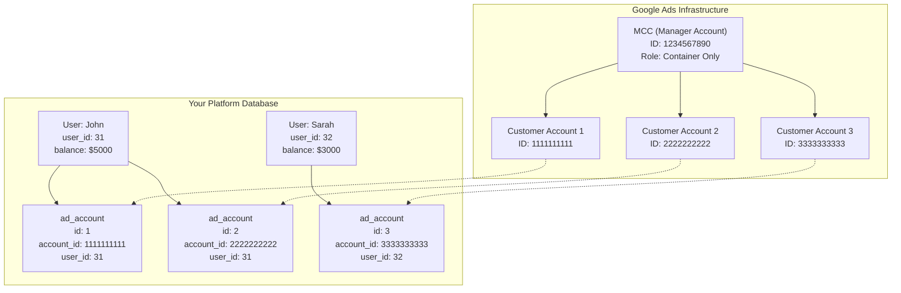
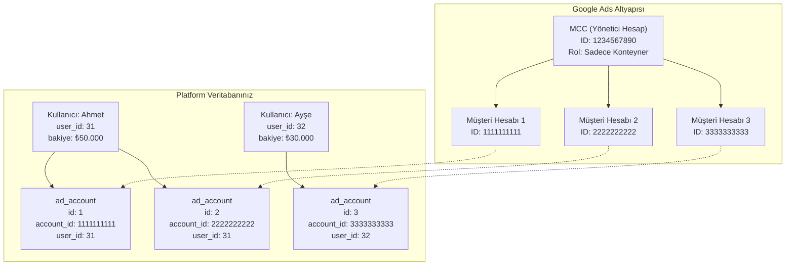

I'll create two markdown files for you - one in English and one in Turkish.

## English Version:

```markdown
# Google Ads API Integration - System Architecture

## System Structure Overview

### Visual Representation



### How It Works

1. **MCC (Manager Account)**
   - Just an umbrella account in Google Ads
   - Not stored in your database
   - Only used for API authentication (`loginCustomerId`)

2. **Google Ads Customer Accounts**
   - Created under the MCC
   - Each one maps to a row in your `ad_accounts` table
   - Identified by `account_id` (Google Ads Customer ID)

3. **Your Platform Users**
   - Can own multiple Google Ads accounts
   - Relationship: One User → Many Ad Accounts

## What You CAN Do with Basic API Access ✅

### 1. ✅ Spend Tracking & Synchronization
- **Fetch actual spend** from Google Ads accounts
- **Update** `budget_transactions` table with real data
- **Sync** `ad_accounts.total_spent` field
- **Generate spend reports** for customers

**Implementation Status:** Ready to implement

### 2. ✅ Invoice Retrieval
- **Fetch monthly invoices** from Google Ads
- **Display invoices** to customers in dashboard
- **Download invoice PDFs**

**Implementation Status:** Ready to implement

### 3. ✅ Account Status Monitoring
- **Check account verification status**
- **Monitor account status** (active, suspended)
- **Sync status** to `ad_accounts.status` field

**Implementation Status:** Ready to implement

### 4. ✅ List Existing Accounts
- **Fetch all accounts** under your MCC
- **Get account details** (name, currency, timezone)
- **Verify account access**

**Implementation Status:** Ready to implement

## What You CANNOT Do with Basic API Access ❌

### 1. ❌ Account Creation
- Cannot create new Google Ads accounts via API
- Must be done manually through Google Ads UI

### 2. ❌ User Access Management
- Cannot invite users to accounts via API
- Must be done manually through Google Ads UI

### 3. ❌ Billing Setup
- Cannot set up invoice/credit line billing via API
- Must be done manually through Google Ads UI

### 4. ❌ Budget Management
- Cannot create or modify account budgets via API
- Must be done manually through Google Ads UI

### 5. ❌ Account Suspension
- Cannot suspend/unsuspend accounts via API
- Must be done manually through Google Ads UI

## Development Roadmap

### Phase 1: Basic API Implementation (Current)
- [x] Database structure ready
- [ ] Implement spend tracking
- [ ] Implement invoice retrieval
- [ ] Implement status monitoring
- [ ] Create manual process documentation

### Phase 2: Standard API Access (Future)
- [ ] Apply for Standard Access
- [ ] Implement account creation
- [ ] Implement user invitation
- [ ] Implement billing setup
- [ ] Implement budget management
- [ ] Full automation achieved

## Database Mapping

| Your System | Google Ads | Purpose |
|-------------|------------|---------|
| `users` table | - | Platform users |
| `ad_accounts.account_id` | Customer ID | Links to Google Ads |
| `ad_accounts.user_id` | - | Links to platform user |
| `budget_transactions` | - | Tracks all financial movements |
| `account_requests` | - | Pending account creation requests |

## Current Workflow with Basic Access

1. **Customer requests new account** → Stored in `account_requests`
2. **Admin creates account manually** in Google Ads UI
3. **Admin adds Customer ID** to `ad_accounts` table
4. **System starts tracking** spend, invoices, status via API
5. **Customer sees data** in their dashboard
```

## Turkish Version:

```markdown
# Google Ads API Entegrasyonu - Sistem Mimarisi

## Sistem Yapısına Genel Bakış

### Görsel Sunum



### Nasıl Çalışır?

1. **MCC (Yönetici Hesap)**
   - Google Ads'de sadece bir şemsiye hesap
   - Veritabanınızda saklanmaz
   - Sadece API kimlik doğrulaması için kullanılır (`loginCustomerId`)

2. **Google Ads Müşteri Hesapları**
   - MCC altında oluşturulur
   - Her biri `ad_accounts` tablosunda bir satıra karşılık gelir
   - `account_id` (Google Ads Müşteri Kimliği) ile tanımlanır

3. **Platform Kullanıcılarınız**
   - Birden fazla Google Ads hesabına sahip olabilir
   - İlişki: Bir Kullanıcı → Birçok Reklam Hesabı

## Temel API Erişimi ile YAPABİLECEKLERİNİZ ✅

### 1. ✅ Harcama Takibi ve Senkronizasyon
- Google Ads hesaplarından **gerçek harcamaları çekme**
- `budget_transactions` tablosunu **gerçek verilerle güncelleme**
- `ad_accounts.total_spent` alanını **senkronize etme**
- Müşteriler için **harcama raporları oluşturma**

**Uygulama Durumu:** Uygulamaya hazır

### 2. ✅ Fatura Alma
- Google Ads'den **aylık faturaları çekme**
- Panelde müşterilere **faturaları gösterme**
- **Fatura PDF'lerini indirme**

**Uygulama Durumu:** Uygulamaya hazır

### 3. ✅ Hesap Durumu İzleme
- **Hesap doğrulama durumunu kontrol etme**
- **Hesap durumunu izleme** (aktif, askıya alınmış)
- `ad_accounts.status` alanına **durum senkronizasyonu**

**Uygulama Durumu:** Uygulamaya hazır

### 4. ✅ Mevcut Hesapları Listeleme
- MCC altındaki **tüm hesapları çekme**
- **Hesap detaylarını alma** (isim, para birimi, saat dilimi)
- **Hesap erişimini doğrulama**

**Uygulama Durumu:** Uygulamaya hazır

## Temel API Erişimi ile YAPAMAYACAKLARINIZ ❌

### 1. ❌ Hesap Oluşturma
- API üzerinden yeni Google Ads hesapları oluşturulamaz
- Google Ads arayüzünden manuel olarak yapılmalıdır

### 2. ❌ Kullanıcı Erişim Yönetimi
- API üzerinden hesaplara kullanıcı davet edilemez
- Google Ads arayüzünden manuel olarak yapılmalıdır

### 3. ❌ Faturalandırma Kurulumu
- API üzerinden fatura/kredi limiti faturalandırması ayarlanamaz
- Google Ads arayüzünden manuel olarak yapılmalıdır

### 4. ❌ Bütçe Yönetimi
- API üzerinden hesap bütçeleri oluşturulamaz veya değiştirilemez
- Google Ads arayüzünden manuel olarak yapılmalıdır

### 5. ❌ Hesap Askıya Alma
- API üzerinden hesaplar askıya alınamaz/açılamaz
- Google Ads arayüzünden manuel olarak yapılmalıdır

## Geliştirme Yol Haritası

### Aşama 1: Temel API Uygulaması (Mevcut)
- [x] Veritabanı yapısı hazır
- [ ] Harcama takibini uygula
- [ ] Fatura almayı uygula
- [ ] Durum izlemeyi uygula
- [ ] Manuel süreç dokümantasyonu oluştur

### Aşama 2: Standart API Erişimi (Gelecek)
- [ ] Standart Erişim için başvur
- [ ] Hesap oluşturmayı uygula
- [ ] Kullanıcı davetini uygula
- [ ] Faturalandırma kurulumunu uygula
- [ ] Bütçe yönetimini uygula
- [ ] Tam otomasyon sağlandı

## Veritabanı Eşleştirmesi

| Sizin Sisteminiz | Google Ads | Amaç |
|------------------|------------|------|
| `users` tablosu | - | Platform kullanıcıları |
| `ad_accounts.account_id` | Müşteri ID | Google Ads'e bağlantı |
| `ad_accounts.user_id` | - | Platform kullanıcısına bağlantı |
| `budget_transactions` | - | Tüm finansal hareketleri takip eder |
| `account_requests` | - | Bekleyen hesap oluşturma talepleri |

## Temel Erişim ile Mevcut İş Akışı

1. **Müşteri yeni hesap talep eder** → `account_requests`'e kaydedilir
2. **Yönetici Google Ads arayüzünde** manuel olarak hesap oluşturur
3. **Yönetici Müşteri ID'sini** `ad_accounts` tablosuna ekler
4. **Sistem API üzerinden** harcama, fatura, durum takibine başlar
5. **Müşteri panelinde** verileri görür
```

Both files provide a clear visual representation and checklist specifically tailored to your system's features with Basic API access!
